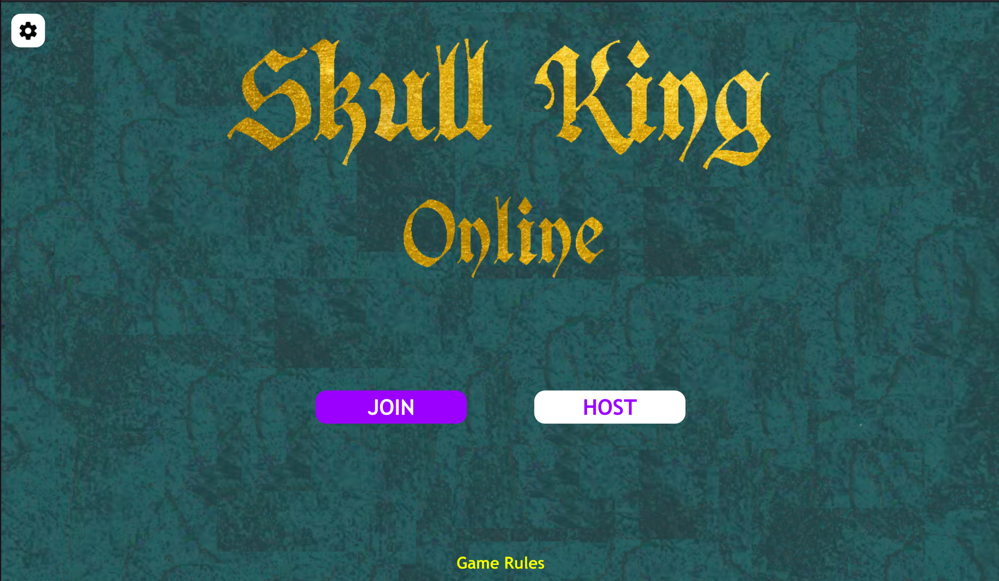

# SoPra Group 6 - Skull King Online
The goal of this project is to create an online version of the popular game [Skull King](https://www.schmidtspiele.de/details/produkt/skull-king.html). Skull King
Online allows up to 6 players to play this exciting pirates' contest in which you have to win tricks in order to get or lose glory and fame.
Whether you're a seasoned Skull King player or new to the game, our online version provides an immersive experience that will keep you coming back for more.

## Table of Content

- [Technologies used](#technologies-used)
- [High-level components](#high-level-components)
- [Deployment](#deployment)
- [Illustrations](#illustrations)
- [Known issues](#known-issues)
- [Roadmap](#roadmap)
- [Authors and acknowledgment](#authors-and-acknowledgment)
- [License](#license)

## Technologies used
* [React.js](https://react.dev/) - Frontend JavaScript library
* [Node.js](https://nodejs.org/) - open-source, cross-platform JavaScript runtime environment
* [NPM](https://www.npmjs.com/) - Build automation tool
* [Axios](https://axios-http.com/) - Promise based HTTP client for node.js
* [Jitsi Meet API](https://jitsi.github.io/handbook/docs/dev-guide/dev-guide-react-sdk) - API for the voice chat functionality

## High-level components

#### GameView
The [GameView](https://github.com/sopra-fs23-group-06/sopra-fs23-group-06-client/blob/main/src/components/views/GameView.js) component is responsible for displaying the game screen with the correct round number, player hand, player bids and tricks won by each player in the current game round.

#### HostLobby/JoinLobby
The [HostLobby](https://github.com/sopra-fs23-group-06/sopra-fs23-group-06-client/blob/main/src/components/views/lobby/HostLobby.js) and [JoinLobby](https://github.com/sopra-fs23-group-06/sopra-fs23-group-06-client/blob/main/src/components/views/lobby/JoinLobby.js) components are responsible for displaying the lobby page when a player hosts (HostLobby) or joins (JoinLobby) a lobby before the game is started.

#### User
The [User](https://github.com/sopra-fs23-group-06/sopra-fs23-group-06-client/blob/main/src/models/User.js) component stores the data about the player in the frontend: The player ID, the lobby ID, the player's username, the player's current bid and the number of tricks won.

#### PlayerHand
The [PlayerHand](https://github.com/sopra-fs23-group-06/sopra-fs23-group-06-client/blob/main/src/components/ui/PlayerHand.js) component contains the cards on a player's hand and is responsible for displaying them correctly. The cards which are not playable during a trick are greyed out.

#### Scoreboard
The [Scoreboard](https://github.com/sopra-fs23-group-06/sopra-fs23-group-06-client/blob/main/src/components/ui/Scoreboard.js) displays all players in the game and keeps track of their scores for every game round. It is shown after every round to inform the players of who is winning at that moment.

## Deployment

### Clone Repository
Clone the client repository onto your local machine with the help of [Git](https://git-scm.com/downloads).
```bash 
git clone https://github.com/sopra-fs23-group-06/sopra-fs23-group-06-client.git
```

### Prerequisites and Installation
For your local development environment, you will need Node.js. You can download it [here](https://nodejs.org). All other dependencies, including React, get installed with:

```npm install```

### Run

Run this command before you start your application for the first time. Next, you can start the app with:

```npm run dev```

Now you can open [http://localhost:3000](http://localhost:3000) to view it in the browser.

Notice that the page will reload if you make any edits. You will also see any lint errors in the console (use Google Chrome).

### Testing
Testing is optional, and you can run the tests with `npm run test`.
This launches the test runner in an interactive watch mode. See the section about [running tests](https://facebook.github.io/create-react-app/docs/running-tests) for more information.

> For macOS user running into a 'fsevents' error: https://github.com/jest-community/vscode-jest/issues/423

### Build
Finally, `npm run build` builds the app for production to the `build` folder.<br>
It correctly bundles React in production mode and optimizes the build for the best performance: the build is minified, and the filenames include hashes.<br>

See the section about [deployment](https://facebook.github.io/create-react-app/docs/deployment) for more information.

### Releases
- For the release feature, refer to the [GitHub documentation](https://docs.github.com/en/repositories/releasing-projects-on-github/managing-releases-in-a-repository)

## Illustrations

#### Start screen


#### Hosted lobby


#### Joined lobby


#### Interface settings


#### Game settings


#### Enter bid


#### Game view


#### Round summary


#### Scoreboard


## Known issues
The free version of the voice chat API being used has a limitation where calls cannot exceed 5 minutes in duration. To address this limitation, the voice chat reloads every 5 minutes, resulting in a brief 2-3 second interruption where the player is temporarily removed from the meeting. Once the call automatically reconnects, it should continue to function smoothly without any further problems.

## Roadmap
Developers who want to contribute to our project could add the following features:
- Add some new and exciting game modes, such as playing with the cards from the [expanded version](https://www.grandpabecksgames.com/products/skull-king)
- Extend the functionality of the voice chat API to highlight the player who is talking at any moment during the game.
- Add a persistent high score view so that one could see the all-time highest scores achieved in the game.

## Authors and acknowledgment
### Authors
* **Roman Mathis** - [Terebos](https://github.com/Terebos)
* **Nikolin Lotter** - [CodeHub3](https://github.com/CodeHub3)
* **Lorenzo Ladner** - [lorezh](https://github.com/lorezh)
* **Matej Gurica** - [bzns](https://github.com/bzns)
* **Linard Jaeggi** - [exostatistic](https://github.com/exostatistic)

### Acknowledgment
* This project is based on the [SoPra FS23 - Client Template](https://github.com/HASEL-UZH/sopra-fs23-template-client)
* We would like to thank our tutor [Luis](https://github.com/luis-tm) as well as the entire team involved in the Software Engineering Lab course at the University of Zurich.

## License
This project is licensed under the GNU AGPLv3 License - see the [LICENSE](https://github.com/sopra-fs23-group-06/sopra-fs23-group-06-client/blob/main/LICENSE) file for details.
